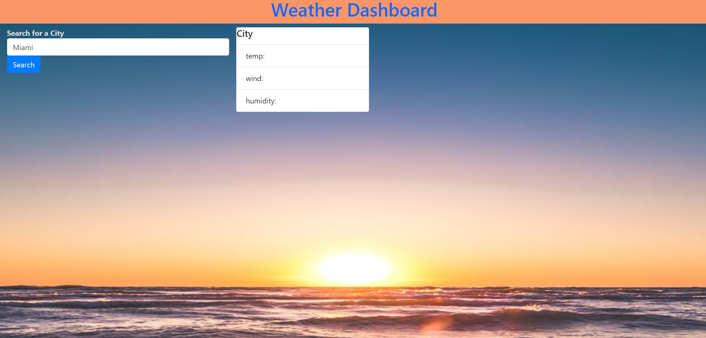
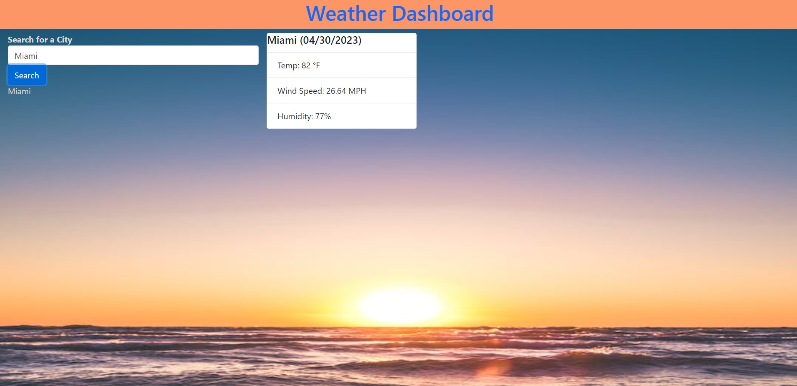

# Weather Dashboard

## Description

An application used for tracking weather conditions by city written in JavaScript.

## Deployed Link

https://kyle188.github.io/weather_dashboard/

## Installation

* Clone repository
* Open index.html in browser

## Usage

* Enter the desired city's name to get up to date weather information 

*  The Weather Dashboard will display the desired city's current temperature, wind speed, and humidity 

## Technologies Used

* JavaScript
* HTML
* CSS
* moment.js

## Questions

Feel free to email me at kybar089@gmail.com or look at my [Github](https://github.com/kyle188)